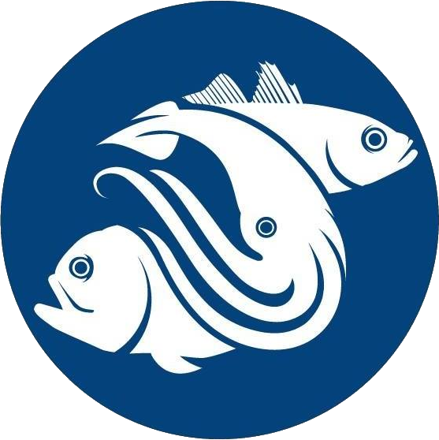

```{r}
date_stamp <- format(Sys.Date(), "%d %B %Y")
time_stamp <- format(Sys.time(), "%H:%M %Z")
```



::: {.content-visible when-format="pdf"}
```{=latex}
\thispagestyle{empty}
\begin{center}
\begin{minipage}[c]{0.18\textwidth}
\centering
\includegraphics[width=\linewidth]{_includes/logo.png}
\end{minipage}\hfill
\begin{minipage}[c]{0.76\textwidth}
{\Huge \textbf{SPRFMO}}\par
{\large South Pacific Regional Fisheries Management Organisation}\par
\vspace{0.4em}
{\Large \textbf{Squid Working Group}}
\end{minipage}
\end{center}
\noindent\rule{\linewidth}{1pt}
\begin{center}\Large\bfseries SPRFMO SC Third Squid Workshop (SCW18)\end{center}
```
:::

::: {.content-visible when-format="docx"}
| {width=1.35in} | **SPRFMO**<br>South Pacific Regional Fisheries Management Organisation<br><br>**Squid Working Group** |
|:---:|:---|

*SPRFMO SC Third Squid Workshop (SCW18)*

:::

```{=html}
<div style="font-style: italic; margin-top: 0.5rem;">Third Squid Workshop (SCW18)</div>
<div style="margin-top: 0.35rem; margin-bottom: 0.35rem;"><a href="SCW18-squid3_meeting_report.pdf">PDF version</a> | <a href="SCW18-squid3_meeting_report.docx">MS Word version</a></div>
```

```{=html}
<div class="paper-title">SPRFMO SC Third Squid Workshop (SCW18)</div>
```

::: {.content-visible when-format="pdf"}
```{=latex}
\begin{center}
`r date_stamp`\\
`r time_stamp`
\end{center}
```
:::

::: {.content-visible .no-para-number unless-format="pdf"}
::: {.no-para-number style="text-align: center; margin-top: 0.75rem; margin-bottom: 1rem;"}
`r date_stamp`<br>
`r time_stamp`
:::
:::

# Summary {.unnumbered}

This is the working draft report for the SPRFMO SC Third Squid Workshop (SCW18), focused on the stock assessment and simulated assessment of jumbo flying squid (*Dosidicus gigas*).

The workshop will focus on two complementary components: advancing the stock assessment of jumbo flying squid and the associated scientific advice to the Scientific Committee and the Commission; and progressing the simulated assessment work needed to evaluate candidate models under alternative assumptions about population structure, fisheries, sampling and data availability.

# Meeting Details

The SPRFMO SC Third Squid Workshop (SCW18) was held in person in Shanghai, China, from 29 July to 1 August 2026. The workshop focused on the stock assessment and simulated assessment of jumbo flying squid and was conducted under the auspices of the South Pacific Regional Fisheries Management Organisation through the Squid Working Group (SQWG), chaired by Dr Gang Li.

# Workshop Objectives

The workshop aims to advance the scientific basis for the assessment of jumbo flying squid in the SPRFMO Convention Area and to support the provision of scientific advice, following the guidance provided by the Commission and the Scientific Committee.

The main objectives are to:

1. Review and advance the stock assessment of jumbo flying squid, including available data, candidate models, assumptions, diagnostics, sensitivities and assessment results.
2. Identify robust assessment conclusions and key uncertainties, including the implications of data limitations, model structure, fleet definitions and biological assumptions for scientific advice.
3. Progress the simulated assessment work, including review of simulation scenarios, simulated datasets and candidate assessment experiments.
4. Develop workshop outputs for SC14, including conclusions, recommendations, reporting responsibilities and a post-workshop workplan for any remaining assessment or simulation tasks.
